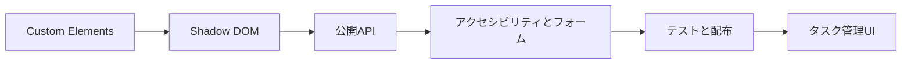

Web Componentsを学ぶと、特定のフレームワークに依存しないUIコンポーネントを作れます。完成した部品はHTML要素として配置でき、JavaScriptからは通常のDOM APIで操作できます。

本書が目指すのはAPIの暗記ではありません。HTML要素として自然に振る舞い、利用する側が内部実装を知らなくても扱えるコンポーネントの設計です。

## 対象読者

JavaScriptまたはTypeScriptの基本文法を理解し、`querySelector()`や`addEventListener()`を使った経験がある人を想定しています。React、Vue、Angularなどの経験は必要ありません。

次のような疑問を持っている人には、特に役立つはずです。

- Web Componentsとフレームワークのコンポーネントは何が違うのか
- 属性とプロパティのどちらで値を渡せばよいのか
- Shadow DOMを使うとCSSやイベントに何が起きるのか
- 独自要素をフォームや支援技術に対応させるにはどうするのか
- 作ったコンポーネントを複数のアプリケーションで共有できるのか

## 2つの読書ルート

第1章から第15章までは順番に読む通読部です。Custom Elementsを登録し、Shadow DOMで構造を閉じ、公開APIとアクセシビリティを設計するところまでを一続きで学びます。

まず動くUIまで進みたい場合は、第1章から第15章を読んだあと、第25章へ進んでください。これが最短実装ルートです。

実務で配布・運用するところまで学ぶ場合は、第16章から第24章も順番に読みます。セキュリティ、性能、TypeScript、テスト、配布、フレームワーク連携、SSR、Litを扱う実務ルートです。個別の課題があるときは、この範囲から必要な章だけを引くこともできます。

第26章は用語集と目的別索引です。通読順に関係なく、用語の違いや参照先を確認したいときに使ってください。



## 本書で育てるタスク管理UI

説明だけで終わらないように、同じタスク管理UIを題材にして各APIを確かめます。各章のコードは、注目する仕組みを抜き出した例です。第25章で公開契約をそろえ、4つの要素を`<task-app>`へ統合します。

| 要素 | 役割 | 主に学ぶこと |
|---|---|---|
| `<task-input>` | 新しいタスクを入力する | フォーム、検証、イベント |
| `<task-item>` | 1件のタスクを表示する | 属性、プロパティ、状態、CSS Parts |
| `<task-list>` | 複数のタスクをまとめる | Slot、イベント委譲、配列プロパティ |
| `<task-filter>` | 表示対象を切り替える | `aria-pressed`、roving tabindex、`CustomEvent` |

第23章では、`<task-filter>`の状態表現をCustom Statesで強化する方法も扱います。これは完成に必須ではなく、対象ブラウザに応じて選ぶ拡張です。

最終的には、次のHTMLで利用できる形にします。

```html
<task-app>
  <h1 slot="heading">今日のタスク</h1>
</task-app>
```

`<task-app>`の内部実装が変わっても、この利用コードと公開したイベントが変わらない状態が理想です。

## 開発環境

サンプルはTypeScriptで記述し、Viteでブラウザから動かします。コマンド例にはpnpmを使います。

- Node.js 22.12以降
- pnpm
- Chromium、Firefox、Safariの現行版
- DOMとShadow DOMを確認できるブラウザの開発者ツール

Web Componentsの中心機能はブラウザに組み込まれています。Custom ElementsやShadow DOMを使うための実行時ライブラリは追加しません。第24章だけはLitを導入し、ネイティブ実装との対応を確かめます。

## 読み終えたときの到達点

本書を読み終えると、次の判断を自分で下せるようになります。

- HTML属性に残す値とDOMプロパティだけに置く値を分ける
- 外へ通知するイベントと内部だけで使うイベントを分ける
- Slot、CSS Custom Properties、CSS Partsの公開範囲を決める
- Shadow DOMを使う理由と使わない理由を説明する
- ネイティブ要素を再利用して、キーボードと支援技術へ対応する
- 実ブラウザで利用者から見える振る舞いをテストする

仕様やブラウザは更新されます。本文中のリンクからHTML Living StandardとMDNを確認し、互換性が重要な機能は対象ブラウザで試してください。誤りや分かりにくい箇所があれば、Zennのコメントを改訂の材料にします。

準備はこれだけです。次章では、Web Componentsを構成する技術を一枚の地図にまとめます。
