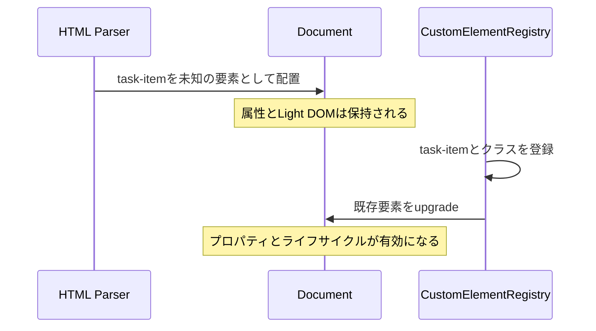
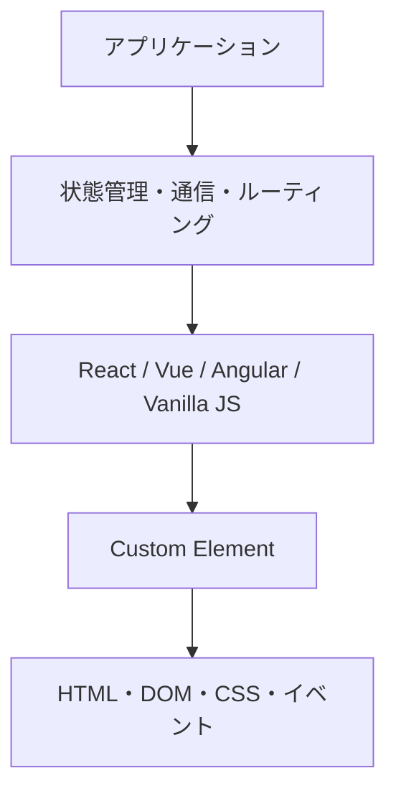
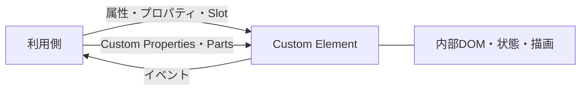

`<button>`や`<details>`と同じ形で使える独自のHTML要素を、ブラウザ標準のAPIで定義する。それがWeb Componentsの出発点です。表示だけの部品に限らず、属性を受け取り、プロパティを持ち、イベントを通知する要素を作れます。

## まず「コンポーネント」をHTML要素として捉える

UIコンポーネントという言葉は、見た目のまとまり、JavaScriptの関数、テンプレートの一部など、文脈によって違うものを指します。本書で扱うコンポーネントの中心は、ブラウザが管理するHTML要素です。

組み込みの`<video>`を考えてみます。HTMLにタグを書けば配置でき、`src`属性で初期値を渡せます。JavaScriptからは`play()`を呼び、再生状況はイベントで受け取れます。ブラウザは要素が文書に接続されたことや、属性が変わったことも把握しています。

Custom Elementも、この要素モデルに参加します。

| 接点 | 組み込み要素の例 | Custom Elementの例 |
|---|---|---|
| HTML | `<input required>` | `<task-input required>` |
| 属性 | `disabled` | `completed` |
| プロパティ | `input.value` | `item.task` |
| メソッド | `dialog.showModal()` | `input.reportValidity()` |
| イベント | `change` | `task-toggle` |
| CSS | `button:disabled` | `task-item[completed]` |

つまりWeb Componentsは、HTMLの見た目だけを短縮するマクロではありません。HTML、DOM、イベント、CSSというWebの既存の接点へ、独自要素を参加させる仕組みです。

## 未知のタグが「部品」へ変わる

ブラウザは、まだ定義されていない`<task-item>`を見てもHTMLの解析を止めません。未知の要素としてDOMに置き、子要素や属性を保持します。その後、JavaScriptが`task-item`という名前とクラスを登録すると、既存の要素もそのクラスの振る舞いを持つようになります。この変化をupgradeと呼びます。

この性質により、HTMLを先に表示し、JavaScriptをあとから読み込めます。一方で、定義前にも要素が存在するため、「コンストラクターが呼ばれるまで何もない」と考えると状態を取りこぼします。第4章で登録とupgradeを詳しく扱うのは、この時間差が設計に影響するからです。



## Web Componentsは4つの技術を組み合わせる

「Web Components」という名前のAPIを1つ呼び出すわけではありません。独自要素を定義するCustom Elements、DOMとCSSに境界を作るShadow DOM、構造を再利用する`<template>`、外から渡された内容を配置する`<slot>`などを組み合わせる総称です。

すべてを必ず使うわけでもありません。Custom Elementを定義し、内部には通常のLight DOMだけを使う設計もできます。目的に応じて、次の技術から必要なものを選びます。

| 技術 | 担当する仕事 |
|---|---|
| Custom Elements | 独自の要素名とJavaScriptクラスを結びつける |
| Shadow DOM | 内部のDOMとCSSに境界を作る |
| `<template>` | すぐには表示しないHTMLのひな形を保持する |
| `<slot>` | 利用者が書いた子要素を内部レイアウトへ差し込む |

たとえば`<task-item>`では、Custom Elementsが要素の動作を定義します。Shadow DOMがチェックボックスや削除ボタンを内部へ隠し、Slotがタスク名を受け取ります。

```html
<task-item completed>
  原稿をレビューする
</task-item>
```

利用者から見える契約は短いHTMLです。内部では複数の要素やスタイルを使っていても、利用者はその構造を知る必要がありません。

ここでいう「隠す」は、セキュリティ上の秘密にするという意味ではありません。`open`なShadow RootはJavaScriptから参照できます。目的は、内部のクラス名やDOM構造を利用側のCSSとコードから切り離し、変更範囲を明確にすることです。

## JavaScriptクラスだけでは得られない接点がある

通常のJavaScriptクラスでも、データと処理をまとめられます。しかし、クラスのインスタンスをHTMLへ宣言的に置いたり、CSSセレクターで選んだり、DOMイベントの伝播経路へ自然に参加させたりするには、別の接続コードが必要です。

Custom Elementは`HTMLElement`を継承するため、最初からDOMノードです。`querySelector()`で取得でき、`append()`で移動でき、フォームやアクセシビリティツリーとの関係もブラウザの仕組みの上で設計できます。大きな利点は、Webの共通インターフェースをそのまま再利用できることです。

## Web Componentsとフレームワークは担当範囲が違う

ReactやVueのコンポーネントもUIを部品に分けます。ただし、その部品は各フレームワークのレンダリングや状態管理の仕組みの中で動きます。

標準化されるのは、ブラウザ上の要素としての境界です。アプリケーション全体のルーティング、通信、状態管理まで提供する仕組みではありません。この違いを押さえると、両者を無理に競合させずに済みます。



デザインシステムの部品を複数の技術から使いたい場合、Custom Elementは安定した境界になります。一方、ひとつのReactアプリケーション内だけで使う画面部品なら、Reactコンポーネントのまま作るほうが素直なこともあります。

比較すると、担当範囲は次のように分かれます。

| 関心事 | Web Components | アプリケーションフレームワーク |
|---|---|---|
| 独自のHTML要素 | 中心的な担当 | 独自のコンポーネント構文で表現する |
| DOM・CSSの境界 | Shadow DOMで提供 | フレームワークやCSS手法による |
| 画面全体の状態管理 | 提供しない | 選択肢を提供することが多い |
| ルーティング・データ取得 | 提供しない | 周辺機能を含むことが多い |
| 異なる技術間での利用 | DOM契約を共有できる | アダプターが必要になりやすい |

Reactで画面を作り、その中でCustom Elementのデザインシステムを使う構成もあります。Web Componentsの役割は、部品を受け渡す境界の標準化です。アプリケーションの作り方はフレームワークやチームの設計に委ねられます。

## 3つのDOMツリーを区別する

Shadow DOMを使うページには、似た名前の木構造が登場します。

```html
<task-item>
  原稿をレビューする
</task-item>
```

このHTMLにShadow DOMを取り付け、内部に次の構造を作ったとします。

```html
<label>
  <input type="checkbox">
  <slot></slot>
</label>
```

- `<task-item>`を含む通常の文書ツリーがDocument Treeです。
- `<task-item>`の子として書かれたテキストはLight DOMにあります。
- `label`や`input`を含む内部構造はShadow Treeにあります。

`<slot>`はLight DOMの内容をShadow Treeの表示位置へ割り当てます。ノード自体をShadow Treeへ移動するわけではありません。開発者ツールが「slotted」と表示するのは、この割り当て関係です。

## HTML要素として振る舞うことが設計基準になる

良いCustom Elementは、組み込み要素の慣習に従います。たとえば真偽値の状態は`disabled="false"`ではなく、`disabled`属性の有無で表します。利用者の操作で値が変わればイベントを通知し、JavaScriptからはプロパティでも読めるようにします。

```ts
const item = document.querySelector('task-item');

item.completed = true;
item.addEventListener('task-toggle', (event) => {
  console.log(event.detail.completed);
});
```

このAPIは、どのフレームワークから呼ぶ場合もDOMの約束として残ります。学ぶ価値は、ここにあります。

## 外から見える5つの接点を先に考える

Custom Elementを設計するときは、内部クラスより先に利用者との接点を考えます。

1. HTMLから渡せる単純な値は属性にする
2. オブジェクトや配列はプロパティで受け取る
3. 利用者の操作や内部で起きた変化はイベントで通知する
4. 外から差し込む構造は`<slot>`として公開する
5. 外から調整できる見た目はCSS Custom PropertiesやCSS Partsとして公開する

この5つがコンポーネントの契約です。Shadow DOM内部の要素名やクラス名は実装詳細であり、原則として契約には含めません。本書で「契約」という言葉を繰り返すのは、この境界の安定性が再利用性を左右するからです。



## Web Componentsが解決しないこと

ブラウザ標準であっても、アプリケーション開発に必要な機能がすべてそろうわけではありません。次の仕組みは対象外です。

- アプリケーション全体の状態管理
- URLルーティング
- サーバーとのデータ取得やキャッシュ
- 宣言的な条件分岐や一覧描画
- プロジェクトのビルド、テスト、配布方針
- 製品に適したアクセシビリティ設計

また、Custom Elementにしただけで高速、安全、アクセシブルになるわけでもありません。更新の仕方が悪ければ遅くなり、外部入力を`innerHTML`へ渡せば危険になり、ネイティブ要素の意味を無視すれば操作しにくくなります。標準APIは設計の土台であって、品質を自動的に保証するものではありません。

## 採用に向く場面と慎重に考える場面

次の用途では、Web Componentsの境界がよく働きます。

- 複数のフレームワークから利用するデザインシステム
- CMSや静的HTMLにも埋め込みたいウィジェット
- 組織や製品をまたいで配布するフォーム部品
- 地図、動画プレーヤー、エディタのように内部が複雑な埋め込みUI

アプリケーション固有の画面を、細かな部品まですべてCustom Element化すると、属性・イベントの変換ばかりが増えることがあります。SSRや状態管理にも別の設計が要ります。採用単位は「再利用する境界がHTML要素として意味を持つか」で決めます。

次章では、最小のCustom Elementをブラウザへ登録します。まず動かし、その後で登録時に何が起きたのかを分解していきましょう。

## 参考資料

- [Web Components - MDN](https://developer.mozilla.org/en-US/docs/Web/API/Web_components)
- [Custom elements - HTML Living Standard](https://html.spec.whatwg.org/multipage/custom-elements.html)
