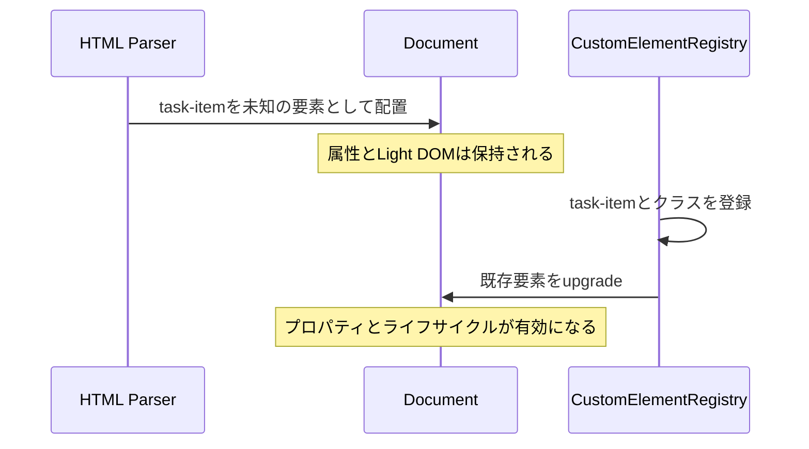
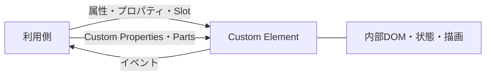

Web Componentsとは、独自のHTML要素をブラウザ標準のAPIで定義するための技術群です。`<button>`や`<details>`と同じ形で使える要素を自分で作り、属性を受け取り、プロパティを持ち、イベントを通知させられます。

目的は、UIの部品をフレームワークから切り離し、HTMLとDOMの共通語彙として配れるようにすることです。この章では、その技術群の全体像を一枚の地図としてつかみます。

## コンポーネントはHTML要素である

UIコンポーネントという言葉は、見た目のまとまり、JavaScriptの関数、テンプレートの一部など、文脈によって違うものを指します。本書で扱うコンポーネントの中心は、ブラウザが管理するHTML要素です。

組み込みの`<video>`はタグを書けば配置でき、`src`属性で初期値を渡せ、`play()`で操作でき、再生状況をイベントで通知します。Custom Elementも同じ要素モデルに参加します。

| 接点 | 組み込み要素の例 | Custom Elementの例 |
|---|---|---|
| HTML | `<input required>` | `<task-input required>` |
| 属性 | `disabled` | `completed` |
| プロパティ | `input.value` | `item.task` |
| メソッド | `dialog.showModal()` | `input.reportValidity()` |
| イベント | `change` | `task-toggle` |
| CSS | `button:disabled` | `task-item[completed]` |

Web Componentsは、HTML、DOM、イベント、CSSというWebの既存の接点へ独自要素を参加させる仕組みです。見た目の記述を短縮するマクロではありません。

## 登録前のタグとupgrade

ブラウザは、まだ定義されていない`<task-item>`を見てもHTMLの解析を止めません。未知の要素としてDOMに置き、子要素や属性を保持します。その後にJavaScriptが名前とクラスを登録すると、既存の要素もそのクラスの振る舞いを持ちます。この変化をupgradeと呼びます。

おかげでHTMLを先に表示し、JavaScriptをあとから読み込めます。ただし定義前にも要素が存在するため、「コンストラクターが呼ばれるまで何もない」と考えると状態を取りこぼします。この時間差は設計に影響するので、『要素の定義とアップグレード』の章で詳しく扱います。



## 4つの技術の組み合わせ

Web Componentsは、次の4つのAPIを組み合わせた総称です。4つすべてを必ず使うわけではなく、Custom Elementを定義して内部には通常のLight DOMだけを使う設計もできます。

| 技術 | 担当する仕事 |
|---|---|
| Custom Elements | 独自の要素名とJavaScriptクラスを結びつける |
| Shadow DOM | 内部のDOMとCSSに境界を作る |
| `<template>` | すぐには表示しないHTMLのひな形を保持する |
| `<slot>` | 利用者が書いた子要素を内部レイアウトへ差し込む |

たとえば`<task-item>`では、Custom Elementsが動作を定義し、Shadow DOMがチェックボックスや削除ボタンを内部へ隠し、Slotがタスク名を受け取ります。

```html
<task-item completed>
  原稿をレビューする
</task-item>
```

利用者から見える契約はこの短いHTMLだけです。ここでの「隠す」はセキュリティ上の秘密ではありません。`open`なShadow RootはJavaScriptから参照できます。内部のクラス名やDOM構造を利用側のCSSとコードから切り離し、変更できる範囲を明確にするのが目的です。

## DOMノードであることの価値

通常のJavaScriptクラスでもデータと処理はまとめられますが、そのインスタンスをHTMLへ宣言的に置いたり、CSSセレクターで選んだり、イベントの伝播経路へ参加させたりするには接続コードが要ります。Custom Elementは`HTMLElement`を継承するため、最初からDOMノードです。`querySelector()`で取得でき、`append()`で移動でき、フォームやアクセシビリティツリーとの関係もブラウザの仕組みの上で設計できます。

## フレームワークとの違いと使いどころ

ReactやVueのコンポーネントもUIを部品に分けますが、その部品は各フレームワークのレンダリングや状態管理の仕組みの中で動きます。Web Componentsが標準化するのは、ブラウザ上の要素としての境界だけです。

| 関心事 | Web Components | アプリケーションフレームワーク |
|---|---|---|
| 独自のHTML要素 | 中心的な担当 | 独自のコンポーネント構文で表現する |
| DOM・CSSの境界 | Shadow DOMで提供 | フレームワークやCSS手法による |
| 状態管理・ルーティング・データ取得 | 提供しない | 選択肢や周辺機能を含むことが多い |
| 異なる技術間での利用 | DOM契約を共有できる | アダプターが必要になりやすい |

宣言的な条件分岐や一覧描画も範囲外です。Custom Elementにしただけで高速、安全、アクセシブルになるわけでもありません。更新の仕方が悪ければ遅くなり、外部入力を`innerHTML`へ渡せば危険になります。標準APIは設計の土台であり、品質を自動的に保証する仕組みではありません。

境界がよく働くのは、複数のフレームワークから使うデザインシステム、CMSや静的HTMLへ埋め込むウィジェット、組織をまたいで配布するフォーム部品です。逆に、ひとつのReactアプリケーション内だけで使う画面部品を細かくCustom Element化すると、属性とイベントの変換ばかりが増えます。採用単位は「再利用する境界がHTML要素として意味を持つか」で決めます。

## 3つのDOMツリー

Shadow DOMを使うページには、似た名前の木構造が3つ登場します。

```html
<task-item>
  原稿をレビューする
</task-item>
```

このHTMLにShadow DOMを取り付け、内部に次の構造を作ったとします。

```html
<label>
  <input type="checkbox">
  <slot></slot>
</label>
```

- `<task-item>`を含む通常の文書ツリーがDocument Treeです。
- `<task-item>`の子として書かれたテキストはLight DOMにあります。
- `label`や`input`を含む内部構造はShadow Treeにあります。

`<slot>`はLight DOMの内容をShadow Treeの表示位置へ割り当てます。ノード自体をShadow Treeへ移動するわけではありません。開発者ツールが「slotted」と表示するのは、この割り当て関係です。

## 設計基準はHTML要素の慣習

良いCustom Elementは組み込み要素の慣習に従います。真偽値の状態は`disabled`属性の有無で表し、利用者の操作で値が変わればイベントを通知し、JavaScriptからはプロパティでも読めるようにします。

```ts
const item = document.querySelector('task-item');

item.completed = true;
item.addEventListener('task-toggle', (event) => {
  console.log(event.detail.completed);
});
```

このAPIは、どのフレームワークから呼ぶ場合もDOMの約束として残ります。

## 外から見える5つの接点

Custom Elementを設計するときは、内部クラスより先に利用者との接点を考えます。

1. HTMLから渡せる単純な値は属性にする
2. オブジェクトや配列はプロパティで受け取る
3. 利用者の操作や内部で起きた変化はイベントで通知する
4. 外から差し込む構造は`<slot>`として公開する
5. 外から調整できる見た目はCSS Custom PropertiesやCSS Partsとして公開する

この5つがコンポーネントの契約です。Shadow DOM内部の要素名やクラス名は実装詳細で、原則として契約には含めません。境界の安定性が再利用性を左右するため、本書では以降も「契約」という言葉を使います。



## まとめ

この章では、Web Componentsの全体像を確認しました。

- Web Componentsは、独自のHTML要素をブラウザ標準のAPIで定義する技術群です。
- Custom Elements、Shadow DOM、`<template>`、`<slot>`を目的に応じて選んで組み合わせます。
- 未定義のタグもDOMに残り、クラスが登録された時点でupgradeされます。
- Shadow DOMを使うページでは、Document Tree、Light DOM、Shadow Treeを区別して考えます。
- 利用者との契約は属性、プロパティ、イベント、Slot、CSSの公開点という5つの接点です。
- 状態管理やルーティングは範囲外で、境界の標準化だけを担います。

次章では、最小のCustom Elementをブラウザへ登録します。まず動かし、その後で登録時に何が起きたのかを分解していきましょう。

## 参考資料

- [Web Components - MDN](https://developer.mozilla.org/en-US/docs/Web/API/Web_components)
- [Custom elements - HTML Living Standard](https://html.spec.whatwg.org/multipage/custom-elements.html)
