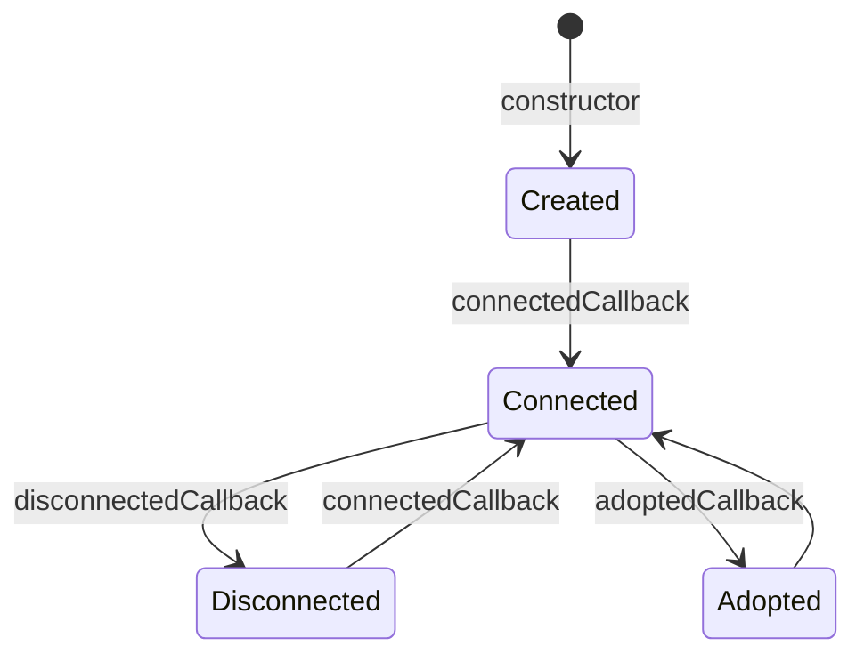

ライフサイクルコールバックとは、要素の生成・接続・切断・属性変更のときにブラウザが呼び出すメソッドです。Custom Elementのクラスに決められた名前のメソッドを書いておくと、その場面が来たときにブラウザが呼んでくれます。

通常のクラスでは、生成後の開始と終了をアプリケーション側が呼び出すことがあります。DOM要素の場合、接続状態を知っているのはブラウザです。そこでCustom Elementは、ブラウザからの通知に応答する形で初期化と後始末を書きます。

この章の核は、接続と切断が何度も繰り返されることです。Custom Elementは一度表示されたら終わりではありません。条件分岐でDOMから外れ、別の場所へ追加され、別文書へ移されることがあります。接続のたびにイベントリスナーを重ねる実装や、最初の切断ですべての内部状態を壊す実装は、再接続したときに不具合を起こします。

ライフサイクルが表すのは、あくまでDOMと文書の関係です。「画面が開いた」「コンポーネントが破棄された」といったアプリケーション固有の出来事とは対応しません。要素が一時的に外れただけでも`disconnectedCallback()`は呼ばれるため、切断と永久破棄を同じものとして扱わない設計が必要になります。

## コールバックの種類と役割

ブラウザが呼ぶ主なコールバックは次のとおりです。

| コールバック | 呼ばれる場面 | 主な用途 |
|---|---|---|
| `constructor()` | インスタンス生成時 | 内部状態とShadow Rootの準備 |
| `connectedCallback()` | 文書へ接続された時 | イベント購読、表示開始 |
| `disconnectedCallback()` | 文書から外れた時 | 購読解除、タイマー停止 |
| `attributeChangedCallback()` | 監視属性が変わった時 | 属性を状態へ反映 |
| `adoptedCallback()` | 別のDocumentへ移った時 | 文書に依存する参照の更新 |

`constructor()`は通常1回ですが、接続と切断は繰り返されます。



## AbortControllerでイベントを接続単位に管理する

`<task-clock>`を例に、接続中だけボタンのクリックを監視します。

```ts:src/task-clock.ts
export class TaskClock extends HTMLElement {
  #controller?: AbortController;
  #seconds = 0;

  connectedCallback(): void {
    if (this.#controller) return;

    this.#controller = new AbortController();

    this.addEventListener('click', this.#handleClick, {
      signal: this.#controller.signal,
    });

    this.#render();
  }

  disconnectedCallback(): void {
    this.#controller?.abort();
    this.#controller = undefined;
  }

  #handleClick = (): void => {
    this.#seconds += 60;
    this.#render();
  };

  #render(): void {
    this.textContent = `${this.#seconds / 60}分`;
  }
}
```

`AbortController`を使うと、登録したリスナーをひとつずつ同じ関数参照で削除する必要がありません。切断時に`abort()`するだけで、この接続中に登録したリスナーを解除できます。

`connectedCallback()`冒頭のガードも大切です。接続中に誤って初期化処理を複数回呼んでも、リスナーが重なりません。

## タイマーとObserverも切断時に止める

イベント以外にも、接続中だけ必要な処理があります。

```ts
class RelativeTime extends HTMLElement {
  #timer?: number;

  connectedCallback(): void {
    this.#update();
    this.#timer ??= window.setInterval(() => this.#update(), 30_000);
  }

  disconnectedCallback(): void {
    if (this.#timer !== undefined) {
      window.clearInterval(this.#timer);
      this.#timer = undefined;
    }
  }

  #update(): void {
    // 現在時刻との差を表示する
  }
}
```

`ResizeObserver`、`MutationObserver`、`IntersectionObserver`も同じです。接続時に監視を始め、切断時に`disconnect()`します。外した要素を監視し続けると、不要な処理と参照が残ります。

## 状態は切断しただけでは捨てない

`disconnectedCallback()`が呼ばれても、要素が完全に不要になったとは限りません。並べ替えの途中で一時的に外れただけかもしれないからです。

```ts
list.append(existingTaskItem);
```

既存要素を別の親へ`append()`すると、切断と再接続が発生します。入力途中の値や選択状態まで`disconnectedCallback()`で初期化すると、DOMを並べ替えただけで利用者の操作が失われます。

止めるのは外部との接続です。要素自身が持つ状態は、明示的なリセット操作があるまで保持するのが基本になります。

## 属性変更は専用コールバックで受ける

監視する属性は`observedAttributes`で宣言します。

```ts
class TaskItem extends HTMLElement {
  static observedAttributes = ['completed'];

  attributeChangedCallback(
    name: string,
    oldValue: string | null,
    newValue: string | null,
  ): void {
    if (name === 'completed' && oldValue !== newValue) {
      this.#renderCompleted();
    }
  }

  #renderCompleted(): void {}
}
```

このコールバックは接続前にも呼ばれます。内部DOMがまだ必要なら、コンストラクターで用意しておくか、接続状態を`this.isConnected`で確認します。属性とプロパティの同期方法は次章で一本化します。

## Light DOMの子要素がそろう時点を決める

コンストラクターで`this.children`を読んではいけません。HTMLパーサーが開始タグを見つけた直後に要素を生成した時点では、終了タグまで解析されていない可能性があります。

`<slot>`を使う要素なら、子要素の変化は`slotchange`で受けると安定します。Light DOMを直接読む必要がある場合は、要素定義の読み込み順を管理し、接続後に読む設計を明記します。

## 要素を移動する新しいライフサイクル

HTML標準には、状態を保ったまま要素を移動する`Element.moveBefore()`と、移動時に呼ばれる`connectedMoveCallback()`があります。従来の切断・再接続を避けられる仕組みです。

```ts
class MovablePanel extends HTMLElement {
  connectedMoveCallback(): void {
    // 状態を保つ移動では、再初期化しない
  }
}
```

このAPIは新しいため、採用前に対象ブラウザの対応状況を確認してください。本書の基本実装は、従来どおり切断と再接続が起きても壊れない形にします。

## まとめ

この章では、Custom Elementのライフサイクルコールバックを学びました。

- ライフサイクルコールバックは、生成・接続・切断・属性変更のときにブラウザが呼ぶメソッドです。
- `constructor()`は1回ですが、`connectedCallback()`と`disconnectedCallback()`は何度でも繰り返されます。
- 接続中に登録したリスナーは、`AbortController`を使うと切断時にまとめて解除できます。
- タイマーやObserverも、接続時に開始して切断時に止めます。
- 切断は永久破棄とは限らないため、要素自身が持つ状態は保持したままにします。
- 監視する属性は`observedAttributes`で宣言し、`attributeChangedCallback()`で受け取ります。

次章では、利用者と値をやり取りする属性とプロパティを設計します。ライフサイクルで整えた土台の上に、外部から値を受け取る入口を作っていきます。

## 参考資料

- [Using custom elements - MDN](https://developer.mozilla.org/en-US/docs/Web/API/Web_components/Using_custom_elements)
- [Element.moveBefore() - MDN](https://developer.mozilla.org/en-US/docs/Web/API/Element/moveBefore)
