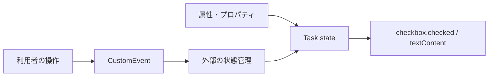

Custom Elementsはレンダリング方法を規定しません。`createElement()`で組み立てても、`innerHTML`を使っても、Litのテンプレートを使っても構いません。自由だからこそ、更新のたびに何を残すかを自分で決める必要があります。

本書のネイティブ実装では、内部DOMを最初に一度だけ作り、状態が変わったら必要なプロパティだけを更新します。

## 状態・派生値・DOMを分ける

`<task-item>`が持つ状態はタスクデータです。チェックボックスの`checked`やラベルの`textContent`は、その状態から計算できる表示結果にすぎません。



外部が状態を所有し、要素は受け取った状態を表示します。利用者の操作を検知したら、勝手に外部データを書き換えずイベントで通知します。この一方向の流れは、フレームワークから利用するときにも扱いやすい形です。

## 内部DOMはコンストラクターで一度だけ作る

```ts:src/task-item.ts
export interface Task {
  id: string;
  label: string;
  completed: boolean;
}

export class TaskItem extends HTMLElement {
  #task?: Task;
  #checkbox: HTMLInputElement;
  #label: HTMLSpanElement;

  constructor() {
    super();

    const root = this.attachShadow({ mode: 'open' });
    const wrapper = document.createElement('label');

    this.#checkbox = document.createElement('input');
    this.#checkbox.type = 'checkbox';

    this.#label = document.createElement('span');

    wrapper.append(this.#checkbox, this.#label);
    root.append(wrapper);
  }

  get task(): Task | undefined {
    return this.#task;
  }

  set task(value: Task | undefined) {
    this.#task = value;
    this.#requestUpdate();
  }

  #requestUpdate(): void {
    // 次の節で実装する
  }
}
```

`#checkbox`と`#label`の参照を保持しているため、更新時に`querySelector()`を繰り返す必要がありません。

## 同じ処理単位の変更を1回へまとめる

ひとつの処理中に複数のプロパティが変わる場合、変更のたびに描画すると無駄が増えます。`queueMicrotask()`で現在の同期処理が終わった後へ更新をまとめます。

```ts
export class TaskItem extends HTMLElement {
  #updatePending = false;

  #requestUpdate(): void {
    if (this.#updatePending) return;

    this.#updatePending = true;
    queueMicrotask(() => {
      this.#updatePending = false;
      this.#render();
    });
  }

  #render(): void {
    const task = this.#task;

    this.#checkbox.checked = task?.completed ?? false;
    this.#checkbox.disabled = task === undefined;
    this.#label.textContent = task?.label ?? 'タスクがありません';
  }
}
```

これは小さな更新スケジューラーです。複雑な差分計算はしません。それでも、同じ同期処理内の変更を1回へまとめる効果があります。

## innerHTMLによる全置換は利用者の状態も捨てる

次の実装は短く書けます。

```ts
#render(): void {
  this.shadowRoot!.innerHTML = `
    <label>
      <input type="checkbox" ${this.task?.completed ? 'checked' : ''}>
      <span>${this.task?.label ?? ''}</span>
    </label>
  `;
}
```

ただし更新のたびに`input`を作り直します。フォーカス、テキスト選択、入力途中の値、イベントリスナーも失われます。さらに、文字列へ外部入力を差し込むとXSSの入口になります。

静的で信頼できるテンプレートを初期化時に使うことと、外部データを含むHTML文字列で毎回置換することは分けて考えてください。

## イベントリスナーは内部要素の寿命に合わせる

内部DOMを一度しか作らないなら、リスナーもコンストラクターで一度だけ登録できます。

```ts
constructor() {
  super();
  // 内部DOMを作る処理

  this.#checkbox.addEventListener('change', () => {
    const task = this.#task;
    if (!task) return;

    this.dispatchEvent(
      new CustomEvent('task-toggle', {
        bubbles: true,
        composed: true,
        detail: {
          id: task.id,
          completed: this.#checkbox.checked,
        },
      }),
    );
  });
}
```

内部要素はホストと同じ寿命を持つので、接続のたびに付け直す必要はありません。`window`や`document`へ登録するリスナーは要素より長く残り得るため、第5章のように接続と切断で管理します。

## 派生状態を保存しすぎない

`task.completed`があるのに、同じ意味の`#checked`も保存すると同期箇所が増えます。計算できる値は描画時に計算します。

保存する状態は、ほかの値から復元できないものに絞ります。

- 外部から受け取ったタスク
- 利用者が入力中で、まだ外部へ確定していない文字列
- 読み込み中かどうか
- 最後に発生したエラー

DOMそのものを唯一の状態置き場にすると、どの操作で値が変わったか追いにくくなります。反対に、フォーム入力のカーソル位置までJavaScript状態へ写すのも過剰です。所有者を決め、ブラウザが得意な一時状態はDOMへ任せます。

次章では、ここで作った内部DOMの境界をShadow DOMの規則から詳しく読み解きます。
