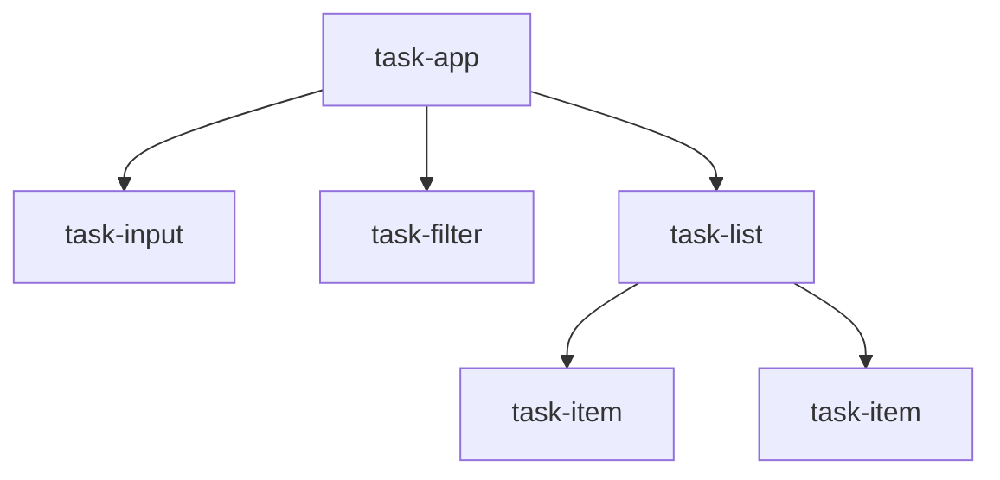

再利用可能なコンポーネントの価値は、内部コードの短さでは決まりません。利用者が覚えるべきAPI名が少なく、変更してよい範囲が明確で、実装を更新しても利用コードが壊れないことが大切です。

## ひとつの要素へひとつの責務を与える

`<task-app>`へ入力、一覧、フィルター、保存、通知のすべてを直接実装すると、どの機能も単独で再利用できません。逆に、ごく小さな表示単位までCustom Elementに分けると、イベントと属性の接続ばかりが増えます。

本書では、HTML上で独立した意味を持つ単位に分けます。



`<task-list>`は一覧の表示と子からのイベント集約を担当します。データの永続化はアプリケーション側の責務です。部品が`localStorage`へ勝手に保存しなければ、サーバー保存やテスト用メモリー実装へ差し替えられます。

## 公開面を6種類に分けて棚卸しする

Custom Elementの契約はJavaScriptメソッドだけではありません。

| 公開面 | `<task-item>`の例 | 用途 |
|---|---|---|
| 属性 | `completed`、`priority` | HTMLに残る短い状態 |
| プロパティ | `task` | オブジェクトや実行中の値 |
| メソッド | `focus()` | 命令として自然な操作 |
| イベント | `task-toggle`、`task-remove` | 内部で起きた操作の通知 |
| Slot | `label`、`meta` | 利用者が渡すHTML |
| スタイルAPI | Custom Properties、Parts | テーマと見た目の拡張 |

追加するAPIがどの種類に属するか決まらない場合、責務が曖昧な可能性があります。

## 属性は組み込みHTMLの慣習に合わせる

既存の名前と同じ意味なら、独自名を増やしません。

- 無効化は`inactive`より`disabled`
- 必須入力は`mandatory`より`required`
- 値は`current-value`より`value`
- 名前は`field-name`より`name`

ただし、組み込み属性と異なる意味で同じ名前を使うと混乱します。`disabled`を表示色の切り替えだけに使わず、操作不可、フォーカス、フォーム値にも一貫して反映します。

## 命令はメソッド、出来事はイベントにする

外部がコンポーネントへ「入力欄へフォーカスしてほしい」と頼むならメソッドが自然です。

```ts
taskInput.focus();
```

利用者が入力を確定した事実はイベントで通知します。

```ts
taskInput.addEventListener('task-create', (event) => {
  addTask(event.detail.label);
});
```

`onCreate`のようなコールバックプロパティを独自に作ると、DOMの`addEventListener()`、イベント委譲、`AbortSignal`を利用できません。通知はDOMイベントへ寄せます。

## 表示内容はSlot、データ処理はプロパティを選ぶ

利用者が意味のあるHTMLを渡したい部分にはSlotが向きます。

```html
<task-item>
  <span slot="label"><strong>原稿</strong>を確認する</span>
  <time slot="meta" datetime="2026-08-12">8月12日</time>
</task-item>
```

並べ替えや検索に使う構造化データはプロパティへ渡します。

```ts
list.tasks = tasks;
```

同じ情報をSlotとプロパティの両方から受け取ると、どちらが正しいか決める必要が生じます。両方を提供する場合は、優先順位と同期規則を文書化してください。

## 内部構造を公開APIにしない

次の利用コードが必要になる設計は、内部実装を変更しにくくします。

```ts
item.shadowRoot
  ?.querySelector('.task-item__delete-button')
  ?.dispatchEvent(new MouseEvent('click'));
```

削除要求を外から起動する必要があるなら、意図を表すメソッドを用意します。

```ts
item.requestRemove();
```

テストも同じです。内部のクラス名を検証するより、公開プロパティ、イベント、アクセシブルな表示結果を確かめます。

## 初期状態と空状態を定義する

値が届く前の表示を決めておくと、遅延アップグレードや非同期通信でも壊れません。

`<task-list>`なら、次の状態を区別します。

- `tasks`が未設定: 読み込み前として何も表示しない
- `tasks`が空配列: 「タスクはありません」と表示する
- 読み込み失敗: `error`プロパティまたは専用Slotで通知する

未設定と空を同じ`[]`へ潰すと、読み込み中に「0件」と誤表示することがあります。

## 変更時は互換性を公開面ごとに判断する

内部の`div`を`article`へ変えるだけなら、通常は利用者に影響しません。しかし、次の変更は公開APIの破壊です。

- 属性名`completed`を`done`へ変える
- `task-toggle`の`detail`から`id`を削除する
- Slot名`meta`を`details`へ変える
- `part="container"`を削除する
- CSS Custom Propertyの意味を変える

Custom Elements Manifestを使うと、これらの公開面を機械可読な形で配布できます。第20章で生成方法を扱います。

## 採用前チェックリスト

新しいCustom Elementを作る前に、次の問いへ答えます。

- 組み込みHTML要素だけで要件を満たせないか
- HTML上で独立した意味や再利用境界があるか
- 状態を誰が所有するか
- 属性、プロパティ、イベントの名前が組み込み要素の慣習に合うか
- SlotとPartsを将来も維持できるか
- JavaScriptが読み込まれる前に何が表示されるか

公開APIが決まったら、次に守るべき利用者は人間です。第14章では、キーボードと支援技術から扱える境界を作ります。
