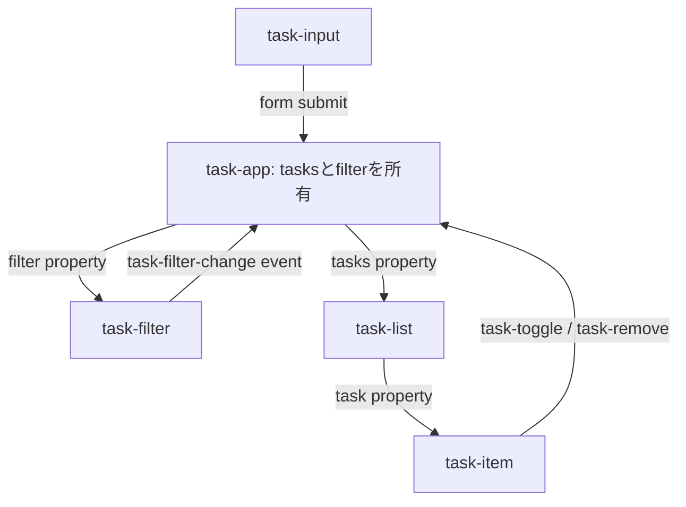

この統合章では、`<task-input>`、`<task-filter>`、`<task-list>`、`<task-item>`を`<task-app>`へ組み込みます。`<task-input>`は第15章、`<task-item>`は第6章から第14章までに確認した公開契約を統合したファイルを使います。ここでは状態の所有者と、要素間の接続に焦点を当てます。

状態は`<task-app>`が所有し、子要素は公開プロパティで表示に必要な状態を受け取り、`CustomEvent`で操作を返します。`<task-item>`は`task`プロパティを受け取り、`task-toggle`と`task-remove`を通知するものとします。`<task-input>`は`value`と`reportValidity()`を公開します。

## 完成時のデータフロー



子要素はアプリケーションの配列を直接変更しません。操作イベントを受けた`<task-app>`が新しい配列を作り、表示用プロパティを更新します。

## Task型とfilter型を共有する

```ts:src/task.types.ts
export type TaskPriority = 'low' | 'normal' | 'high';
export type TaskFilterValue = 'all' | 'active' | 'completed';

export interface Task {
  id: string;
  label: string;
  completed: boolean;
  priority: TaskPriority;
  createdAt: string;
}
```

時刻はISO 8601文字列として保存します。表示時に`Intl.DateTimeFormat`へ渡せ、JSONへ保存しても形が変わりません。

## 既出の2要素を完成ファイルへまとめる

`<task-item>`は、`task`プロパティと`completed`属性から表示を作り、利用者の操作をイベントへ変換します。タスク配列そのものは変更しません。内部でネイティブのチェックボックスとボタンを使い、ラベルと補助情報はSlotで受け取ります。

:::details task-item.tsの完成コード
```ts:src/task-item.ts
import type { Task } from './task.types.js';

const itemTemplate = document.createElement('template');
itemTemplate.innerHTML = `
  <style>
    :host { display: block; }
    :host([hidden]) { display: none; }
    .container {
      display: grid;
      grid-template-columns: auto 1fr auto;
      gap: 0.75rem;
      align-items: center;
      padding: 0.75rem;
      border: 1px solid var(--task-item-border-color, #d7dce5);
      border-radius: var(--task-item-radius, 0.75rem);
      background: var(--task-item-background-color, white);
    }
    :host([completed]) .label { text-decoration: line-through; }
    .content { display: grid; gap: 0.25rem; }
  </style>
  <article class="container" part="container">
    <input type="checkbox" aria-label="完了状態を切り替える">
    <span class="content">
      <span class="label"><slot name="label"></slot></span>
      <small><slot name="meta"></slot></small>
    </span>
    <button type="button" part="remove-button">削除</button>
  </article>
`;

export class TaskItem extends HTMLElement {
  static observedAttributes = ['completed'];

  #task?: Task;
  #checkbox: HTMLInputElement;
  #removeButton: HTMLButtonElement;

  constructor() {
    super();
    const root = this.attachShadow({ mode: 'open' });
    root.append(itemTemplate.content.cloneNode(true));

    const checkbox = root.querySelector('input');
    const removeButton = root.querySelector('button');
    if (!(checkbox instanceof HTMLInputElement)) {
      throw new Error('checkboxが見つかりません');
    }
    if (!(removeButton instanceof HTMLButtonElement)) {
      throw new Error('remove buttonが見つかりません');
    }

    this.#checkbox = checkbox;
    this.#removeButton = removeButton;
  }

  connectedCallback(): void {
    this.#checkbox.addEventListener('change', this.#handleToggle);
    this.#removeButton.addEventListener('click', this.#handleRemove);
    this.#render();
  }

  disconnectedCallback(): void {
    this.#checkbox.removeEventListener('change', this.#handleToggle);
    this.#removeButton.removeEventListener('click', this.#handleRemove);
  }

  attributeChangedCallback(): void {
    this.#render();
  }

  get task(): Task | undefined {
    return this.#task;
  }

  set task(value: Task | undefined) {
    this.#task = value;
    this.completed = value?.completed ?? false;
    this.#render();
  }

  get completed(): boolean {
    return this.hasAttribute('completed');
  }

  set completed(value: boolean) {
    this.toggleAttribute('completed', value);
  }

  #handleToggle = (): void => {
    if (!this.#task) return;

    this.dispatchEvent(
      new CustomEvent('task-toggle', {
        bubbles: true,
        composed: true,
        detail: {
          id: this.#task.id,
          completed: this.#checkbox.checked,
        },
      }),
    );
  };

  #handleRemove = (): void => {
    if (!this.#task) return;

    this.dispatchEvent(
      new CustomEvent('task-remove', {
        bubbles: true,
        composed: true,
        cancelable: true,
        detail: { id: this.#task.id },
      }),
    );
  };

  #render(): void {
    this.#checkbox.checked = this.completed;
  }
}
```
:::

`<task-input>`は、外側のフォームから1つの入力要素として見えるようにします。内部入力の値、フォームへ送る値、制約検証の結果を同じ状態から更新します。DOM上を移動して再接続されても、入力途中の値は初期値へ戻しません。

:::details task-input.tsの完成コード
```ts:src/task-input.ts
const inputTemplate = document.createElement('template');
inputTemplate.innerHTML = `
  <style>
    :host { display: block; }
    :host([hidden]) { display: none; }
    label { display: grid; gap: 0.35rem; }
    #error { color: #b42318; }
  </style>
  <label>
    <span><slot name="label">タスク名</slot></span>
    <input type="text" part="input" aria-describedby="error">
  </label>
  <p id="error" part="error" aria-live="polite"></p>
`;

export class TaskInput extends HTMLElement {
  static formAssociated = true;
  static observedAttributes = ['required'];

  #internals: ElementInternals;
  #input: HTMLInputElement;
  #error: HTMLParagraphElement;
  #defaultValue = '';
  #initialized = false;

  constructor() {
    super();
    this.#internals = this.attachInternals();

    const root = this.attachShadow({ mode: 'open' });
    root.append(inputTemplate.content.cloneNode(true));

    const input = root.querySelector('input');
    const error = root.querySelector('#error');
    if (!(input instanceof HTMLInputElement)) {
      throw new Error('inputが見つかりません');
    }
    if (!(error instanceof HTMLParagraphElement)) {
      throw new Error('errorが見つかりません');
    }

    this.#input = input;
    this.#error = error;
  }

  connectedCallback(): void {
    if (!this.#initialized) {
      this.#defaultValue = this.getAttribute('value') ?? '';
      this.value = this.#defaultValue;
      this.#initialized = true;
    }

    this.#input.required = this.required;
    this.#input.addEventListener('input', this.#handleInput);
    this.#validate();
  }

  disconnectedCallback(): void {
    this.#input.removeEventListener('input', this.#handleInput);
  }

  attributeChangedCallback(name: string): void {
    if (name !== 'required') return;
    this.#input.required = this.required;
    this.#validate();
  }

  get value(): string {
    return this.#input.value;
  }

  set value(value: string) {
    this.#input.value = value;
    this.#internals.setFormValue(value);
    this.#validate();
  }

  get required(): boolean {
    return this.hasAttribute('required');
  }

  set required(value: boolean) {
    this.toggleAttribute('required', value);
  }

  get form(): HTMLFormElement | null {
    return this.#internals.form;
  }

  get labels(): NodeList {
    return this.#internals.labels;
  }

  checkValidity(): boolean {
    return this.#internals.checkValidity();
  }

  reportValidity(): boolean {
    return this.#internals.reportValidity();
  }

  focus(options?: FocusOptions): void {
    this.#input.focus(options);
  }

  formDisabledCallback(disabled: boolean): void {
    this.#input.disabled = disabled;
  }

  formResetCallback(): void {
    this.value = this.#defaultValue;
  }

  formStateRestoreCallback(
    state: string | File | FormData | null,
  ): void {
    if (typeof state === 'string') this.value = state;
  }

  #handleInput = (): void => {
    this.#internals.setFormValue(this.#input.value);
    this.#validate();
    this.dispatchEvent(
      new Event('input', { bubbles: true, composed: true }),
    );
  };

  #validate(): void {
    const missing = this.required && this.value.trim() === '';
    if (missing) {
      const message = 'タスク名を入力してください';
      this.#internals.setValidity(
        { valueMissing: true },
        message,
        this.#input,
      );
      this.#error.textContent = message;
      return;
    }

    this.#internals.setValidity({});
    this.#error.textContent = '';
  }
}
```
:::

## task-filterは選択をイベントで通知する

```ts:src/task-filter.ts
import type { TaskFilterValue } from './task.types.js';

const filterTemplate = document.createElement('template');
filterTemplate.innerHTML = `
  <style>
    :host { display: inline-flex; gap: 0.25rem; }
    :host([hidden]) { display: none; }
    button[aria-pressed='true'] {
      color: white;
      background: var(--task-accent-color, #2563eb);
    }
  </style>
  <button type="button" data-filter="all">すべて</button>
  <button type="button" data-filter="active">未完了</button>
  <button type="button" data-filter="completed">完了済み</button>
`;

export class TaskFilter extends HTMLElement {
  #root: ShadowRoot;
  #value: TaskFilterValue = 'all';

  constructor() {
    super();
    this.#root = this.attachShadow({ mode: 'open' });
    this.#root.append(filterTemplate.content.cloneNode(true));
    this.#root.addEventListener('click', this.#handleClick);
    this.#root.addEventListener('keydown', this.#handleKeydown);
  }

  connectedCallback(): void {
    this.#render();
  }

  get value(): TaskFilterValue {
    return this.#value;
  }

  set value(value: TaskFilterValue) {
    this.#value = value;
    this.#render();
  }

  #handleClick = (event: Event): void => {
    const button = (event.target as Element).closest<HTMLButtonElement>(
      'button[data-filter]',
    );
    if (!button) return;

    const value = button.dataset.filter as TaskFilterValue;
    this.#select(value);
  };

  #handleKeydown = (event: Event): void => {
    if (!(event instanceof KeyboardEvent)) return;
    if (event.key !== 'ArrowLeft' && event.key !== 'ArrowRight') return;

    event.preventDefault();
    const buttons = [
      ...this.#root.querySelectorAll<HTMLButtonElement>('button'),
    ];
    const current = buttons.indexOf(
      this.#root.activeElement as HTMLButtonElement,
    );
    const offset = event.key === 'ArrowRight' ? 1 : -1;
    const next = (current + offset + buttons.length) % buttons.length;
    buttons.forEach((button, index) => {
      button.tabIndex = index === next ? 0 : -1;
    });
    buttons[next]?.focus();
  };

  #select(value: TaskFilterValue): void {
    if (value === this.#value) return;

    this.#value = value;
    this.#render();
    this.dispatchEvent(
      new CustomEvent<TaskFilterValue>('task-filter-change', {
        bubbles: true,
        composed: true,
        detail: value,
      }),
    );
  }

  #render(): void {
    for (const button of this.#root.querySelectorAll('button')) {
      const selected = button.dataset.filter === this.#value;
      button.setAttribute('aria-pressed', String(selected));
      button.tabIndex = selected ? 0 : -1;
    }
  }
}
```

初回接続時にも`#render()`を呼び、`aria-pressed`と`tabIndex`を設定します。コードを短くするため省略した登録処理は章末でまとめます。

## task-listはidを使って既存要素を再利用する

配列更新のたびに全要素を作り直さず、タスクIDから既存の`<task-item>`を探します。

```ts:src/task-list.ts
import type { Task } from './task.types.js';
import type { TaskItem } from './task-item.js';

const listTemplate = document.createElement('template');
listTemplate.innerHTML = `
  <style>
    :host { display: grid; gap: 0.5rem; }
    :host([hidden]) { display: none; }
  </style>
  <div id="items" role="list"></div>
  <p id="empty">タスクはありません。</p>
`;

export class TaskList extends HTMLElement {
  #root: ShadowRoot;
  #items: HTMLDivElement;
  #empty: HTMLParagraphElement;
  #tasks: Task[] = [];
  #elements = new Map<string, TaskItem>();

  constructor() {
    super();
    this.#root = this.attachShadow({ mode: 'open' });
    this.#root.append(listTemplate.content.cloneNode(true));

    const items = this.#root.querySelector('#items');
    const empty = this.#root.querySelector('#empty');
    if (!(items instanceof HTMLDivElement)) throw new Error('items missing');
    if (!(empty instanceof HTMLParagraphElement)) throw new Error('empty missing');
    this.#items = items;
    this.#empty = empty;
  }

  get tasks(): readonly Task[] {
    return this.#tasks;
  }

  set tasks(value: readonly Task[]) {
    this.#tasks = [...value];
    this.#render();
  }

  #render(): void {
    const activeIds = new Set(this.#tasks.map((task) => task.id));

    for (const [id, element] of this.#elements) {
      if (!activeIds.has(id)) {
        element.remove();
        this.#elements.delete(id);
      }
    }

    for (const task of this.#tasks) {
      let item = this.#elements.get(task.id);

      if (!item) {
        item = document.createElement('task-item');
        item.setAttribute('role', 'listitem');
        this.#elements.set(task.id, item);
      }

      item.task = task;
      item.completed = task.completed;

      let label = item.querySelector('[slot="label"]');
      if (!label) {
        label = document.createElement('span');
        label.setAttribute('slot', 'label');
        item.append(label);
      }
      label.textContent = task.label;

      this.#items.append(item);
    }

    this.#empty.hidden = this.#tasks.length > 0;
  }
}
```

既存要素を`append()`すると順序を並べ替えられます。第5章で説明したとおり、`<task-item>`は切断と再接続が起きても状態を失わないように実装します。対象環境で`moveBefore()`を採用できるなら、状態を保つ移動へ置き換えられます。

## task-appが状態を所有する

```ts:src/task-app.ts
import type { Task, TaskFilterValue } from './task.types.js';
import type { TaskFilter } from './task-filter.js';
import type { TaskInput } from './task-input.js';
import type { TaskList } from './task-list.js';

const appTemplate = document.createElement('template');
appTemplate.innerHTML = `
  <style>
    :host {
      display: grid;
      gap: 1rem;
      max-inline-size: 44rem;
      margin-inline: auto;
      font-family: system-ui, sans-serif;
    }
    :host([hidden]) { display: none; }
    form { display: flex; gap: 0.5rem; align-items: end; }
    task-input { flex: 1; }
  </style>

  <header><slot name="heading"><h1>タスク</h1></slot></header>
  <form>
    <task-input name="label" required></task-input>
    <button type="submit">追加</button>
  </form>
  <task-filter></task-filter>
  <task-list></task-list>
  <p id="status" aria-live="polite"></p>
`;

export class TaskApp extends HTMLElement {
  #root: ShadowRoot;
  #input: TaskInput;
  #filter: TaskFilter;
  #list: TaskList;
  #status: HTMLParagraphElement;
  #tasks: Task[] = [];
  #filterValue: TaskFilterValue = 'all';

  constructor() {
    super();
    this.#root = this.attachShadow({ mode: 'open' });
    this.#root.append(appTemplate.content.cloneNode(true));

    const input = this.#root.querySelector('task-input');
    const filter = this.#root.querySelector('task-filter');
    const list = this.#root.querySelector('task-list');
    const status = this.#root.querySelector('#status');
    if (!input || !filter || !list || !(status instanceof HTMLParagraphElement)) {
      throw new Error('task-appの初期化に失敗しました');
    }

    this.#input = input;
    this.#filter = filter;
    this.#list = list;
    this.#status = status;

    this.#root.querySelector('form')?.addEventListener(
      'submit',
      this.#handleSubmit,
    );
    this.addEventListener('task-filter-change', this.#handleFilter);
    this.addEventListener('task-toggle', this.#handleToggle);
    this.addEventListener('task-remove', this.#handleRemove);
  }

  #handleSubmit = (event: Event): void => {
    event.preventDefault();
    if (!this.#input.reportValidity()) return;

    const label = this.#input.value.trim();
    if (!label) return;

    const task: Task = {
      id: crypto.randomUUID(),
      label,
      completed: false,
      priority: 'normal',
      createdAt: new Date().toISOString(),
    };

    this.#tasks = [task, ...this.#tasks];
    this.#input.value = '';
    this.#status.textContent = `「${label}」を追加しました`;
    this.#render();
    this.#input.focus();
  };

  #handleFilter = (event: Event): void => {
    if (!(event instanceof CustomEvent)) return;
    this.#filterValue = event.detail as TaskFilterValue;
    this.#render();
  };

  #handleToggle = (event: Event): void => {
    if (!(event instanceof CustomEvent)) return;
    const { id, completed } = event.detail as {
      id: string;
      completed: boolean;
    };

    this.#tasks = this.#tasks.map((task) =>
      task.id === id ? { ...task, completed } : task,
    );
    this.#render();
  };

  #handleRemove = (event: Event): void => {
    if (!(event instanceof CustomEvent)) return;
    const { id } = event.detail as { id: string };
    queueMicrotask(() => {
      if (event.defaultPrevented) {
        this.#status.textContent = '削除を取り消しました';
        return;
      }

      this.#tasks = this.#tasks.filter((task) => task.id !== id);
      this.#status.textContent = 'タスクを削除しました';
      this.#render();
    });
  };

  #render(): void {
    this.#filter.value = this.#filterValue;
    this.#list.tasks = this.#tasks.filter((task) => {
      if (this.#filterValue === 'active') return !task.completed;
      if (this.#filterValue === 'completed') return task.completed;
      return true;
    });
  }
}
```

`task-remove`はcancelableな操作要求です。`<task-app>`は状態変更をmicrotaskまで遅らせ、イベントの伝播中に外部が`preventDefault()`を呼んだか確認します。取り消されていなければ、状態を所有する`<task-app>`が削除を確定します。

## 依存順に一度だけ登録する

`<task-app>`のコンストラクターは内部で子Custom Elementsを作ります。先に子要素を登録し、最後にアプリケーションを登録します。

```ts:src/register.ts
import { TaskApp } from './task-app.js';
import { TaskFilter } from './task-filter.js';
import { TaskInput } from './task-input.js';
import { TaskItem } from './task-item.js';
import { TaskList } from './task-list.js';

const definitions = [
  ['task-input', TaskInput],
  ['task-filter', TaskFilter],
  ['task-item', TaskItem],
  ['task-list', TaskList],
  ['task-app', TaskApp],
] as const;

for (const [name, constructor] of definitions) {
  if (!customElements.get(name)) {
    customElements.define(name, constructor);
  }
}
```

ページのHTMLは短く保てます。

```html:index.html
<!doctype html>
<html lang="ja">
  <head>
    <meta charset="UTF-8">
    <meta name="viewport" content="width=device-width, initial-scale=1.0">
    <title>Task Components</title>
    <script type="module" src="/src/register.ts"></script>
  </head>
  <body>
    <task-app>
      <h1 slot="heading">今日のタスク</h1>
    </task-app>
  </body>
</html>
```

## 完成後に確認すること

実装が動いたら、まず次の必須項目を確認します。

- 定義前のLight DOMが読め、定義後に正しくアップグレードされる
- タスク名を空のまま送信できない
- Enterで追加し、追加後は入力欄へフォーカスが戻る
- チェック操作が`task-toggle`としてShadow DOMを越える
- フィルターを矢印キーで移動できる
- 削除後に状態と一覧DOMが一致する
- 強制カラーモードと200%拡大でも操作できる

第19章と第21章まで読んだ場合は、次も確認します。

- Chromium、Firefox、WebKitのPlaywrightテストが通る
- React、Vue、Angularのいずれかから、`<task-item>`の`task`プロパティと操作イベントを扱える

永続化を加えるなら、`<task-app>`内部へ直接`fetch()`を書き足す前に境界を考えます。外部へ状態の所有を移す場合は、先に`tasks`プロパティと`tasks-change`イベントを公開契約として追加します。そのうえで保存処理を外へ置けば、REST API、IndexedDB、テスト用メモリー実装を交換できます。

## Web Componentsで守るのは実装より契約

本書では、`HTMLElement`を継承する最小クラスから始めました。その後、属性とプロパティ、ライフサイクル、Shadow DOM、Slot、イベント、スタイル、フォーム、テスト、配布へ範囲を広げました。

中心にある考え方は変わりません。利用者が触るHTML、DOMプロパティ、イベント、Slot、スタイルAPIを先に設計し、内部実装をその契約の内側へ閉じます。

ネイティブDOM APIで実装しても、Litへ移行しても、ReactやAngularから利用しても、契約が残れば部品は使い続けられます。Web Componentsはフレームワークをなくす技術ではありません。Webという共通基盤で、再利用可能なUIを提供するための技術です。
